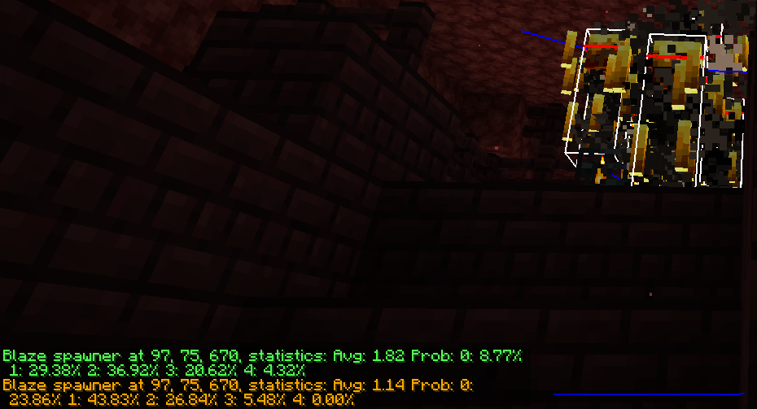
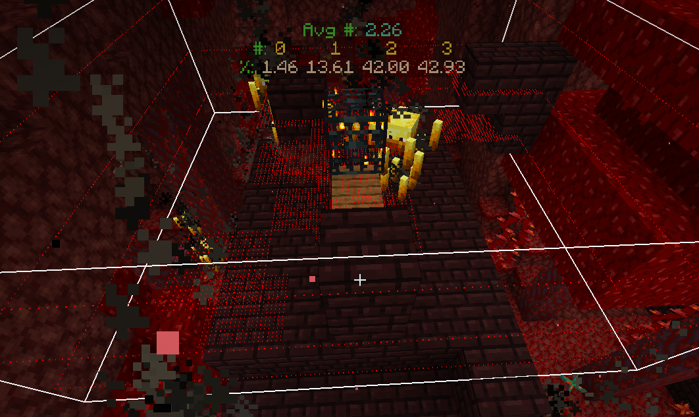

# Marathon

Misc utilities mod for 1.16 speedrunners.

## Utilities

### Spawner Statistics

A near completely accurate simulation of in game spawner behaviour and spawn statistics.

This is useful for testing and evaluating different blaze bedding/mining techniques. The info is calculated and
displayed just _before_ a spawn attempt is made, and simulations are done on a pixel (1/16th of a block) resolution.

The green text displays the chance of spawning x number of blazes and the average number of blazes that will spawn based
on the configuration of blocks, entities, fluid and lighting around the spawner.

Note that this accounts for everything, including the hitboxes of entities (including the player's hitbox) and the
presence of nearby blazes preventing spawn attempts. It also accounts for the impact of multiple spawns in one cycle
taking away potential spawning spaces thanks to a clever forecasting algorithm by Sharpieman20.

The mod will render every spawn position blocked by a block, liquid, entity hitbox, light etc. with a red dot.

If you enable entity hitboxes (F3 + B) you will see a full point cloud. Green represents the highest likelihood of
spawning a blaze, blue the lowest. (Note that at the darkest blue at the edge of the point cloud is functionally
identical to red in terms of spawn chance (ie. none), but is coloured differently nonetheless.)

## Setup

Put the `jar` file in your mods folder with Fabric Loader installed. This mod does not require `Fabric API`. This mod is
developed and tested for `1.16.1` but may work in other versions.

## License

This project is available under the `GPL-3.0` license. Feel free to learn from it and incorporate its components in your
own projects, as long as you abide by the terms of the license.

If you fork the project and distribute your version, please change the name and `modid` to a suitable and distinct
alternative to avoid confusion.
