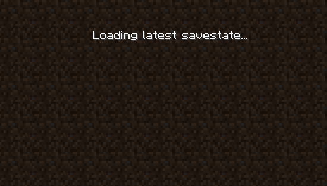
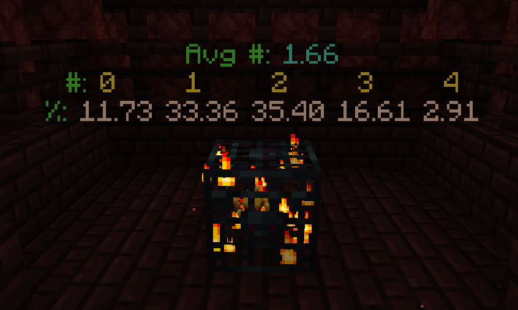
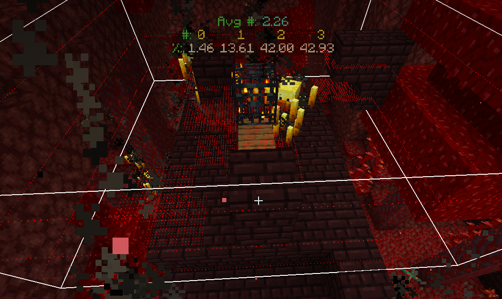
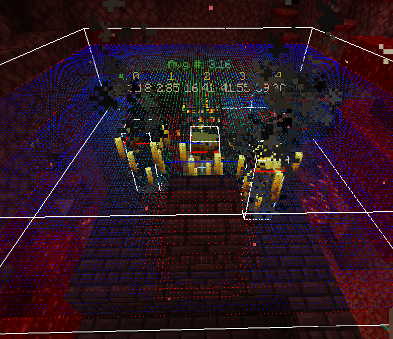
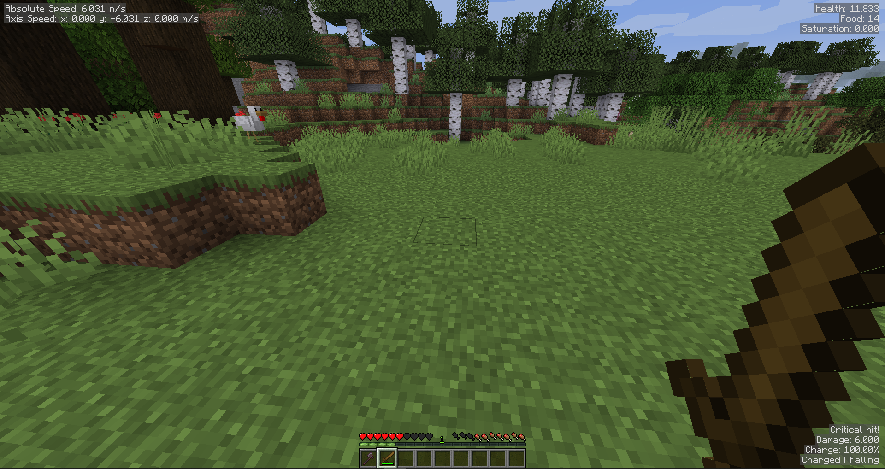
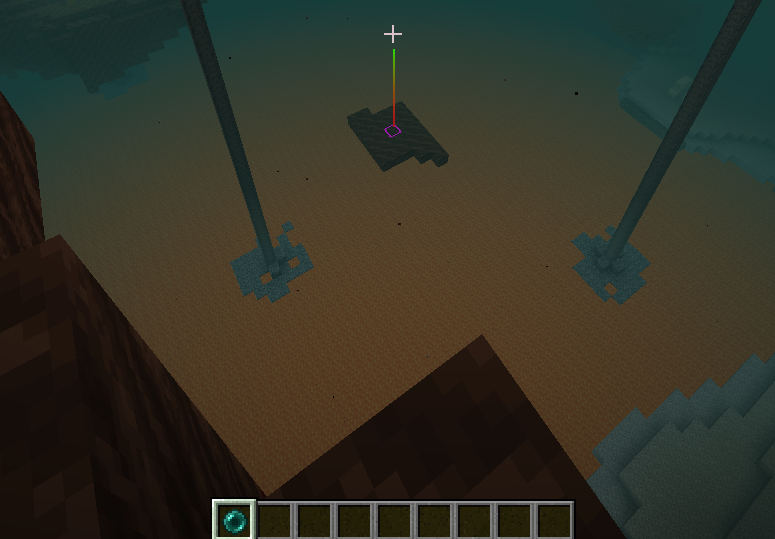
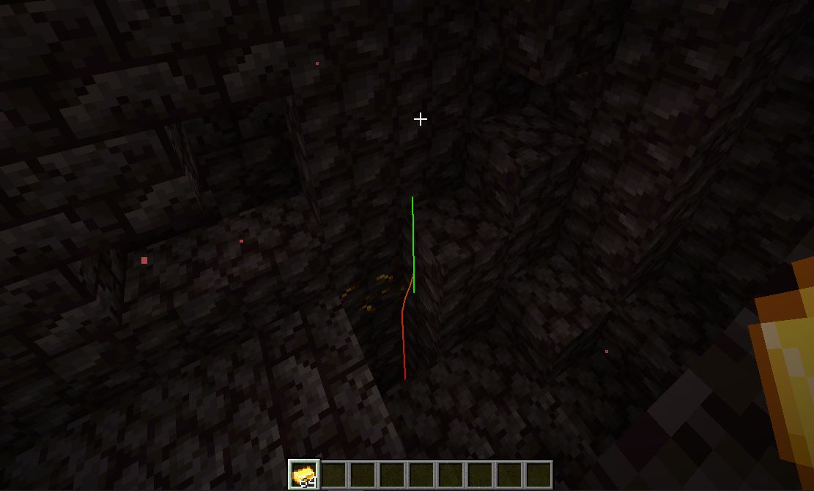
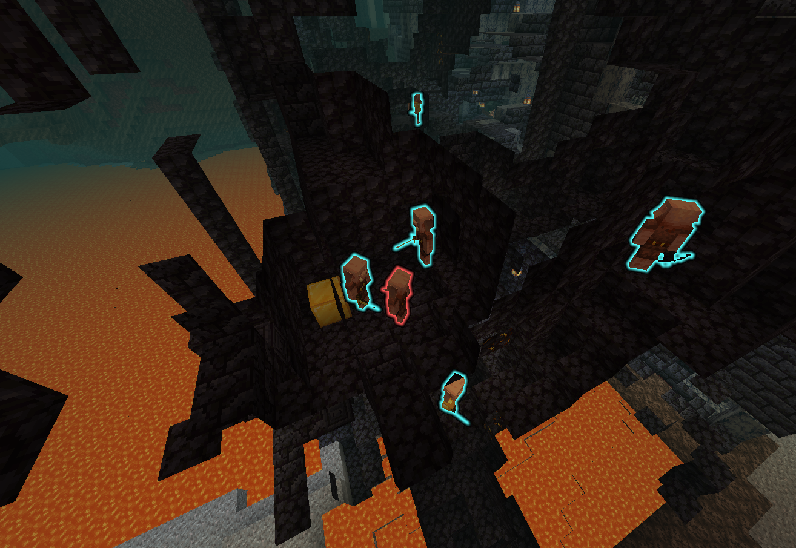
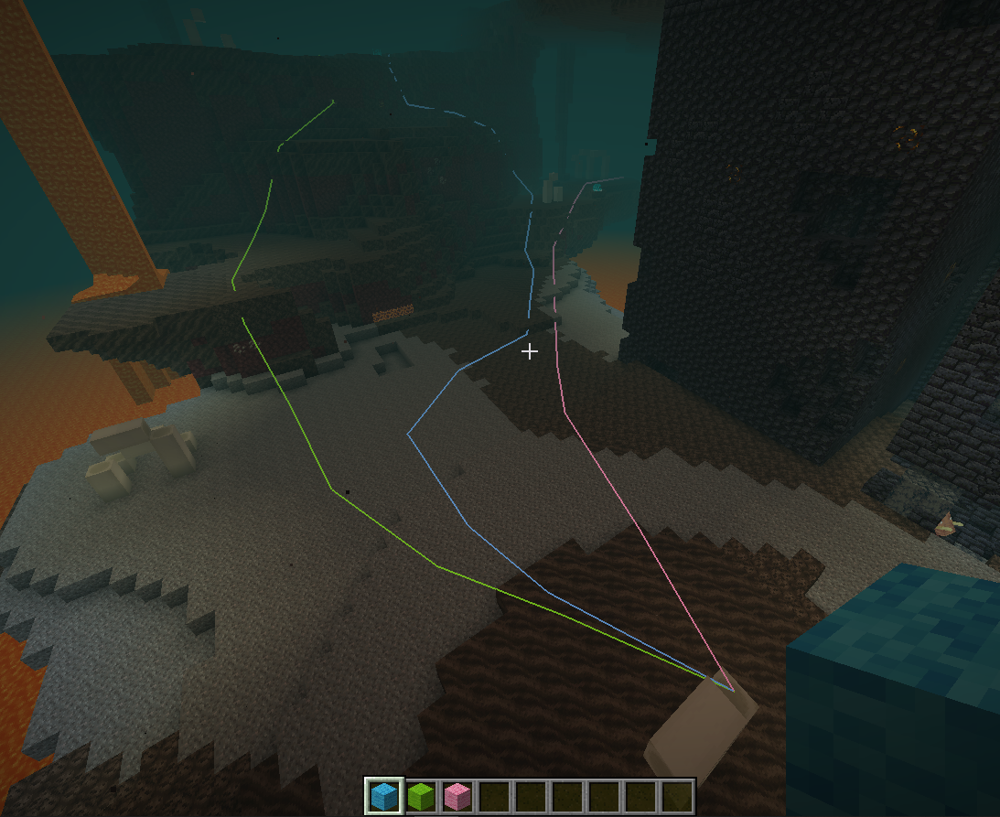
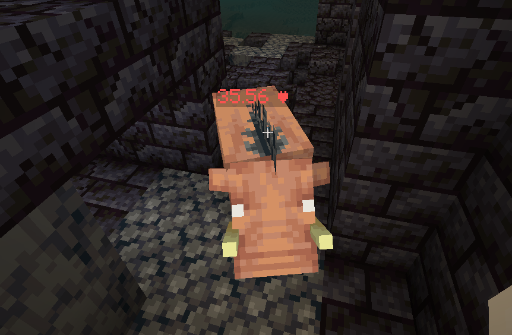

# LogMod

Misc utilities mod for 1.16 speedrunners created in collaboration with k4yfour. (I didn't choose the
name btw 👀). Code and algorithm contributions by al (immigrant) and Sharpieman20.

## Utilities

### Savestates

Implemented through my mod [DeLorean](https://github.com/logwet/delorean) and bundled into LogMod.
Lets you save the current state of the game and load it again at any point. Default hotkeys
are `Page Up` to create a savestate and `Page Down` to load the latest savestate. Use
the `/delorean` command for more options.

### Spawner Statistics

A near completely accurate simulation of in game spawner behaviour and spawn statistics.

This is useful for testing and evaluating different blaze bedding/mining techniques. The info is
calculated and displayed just _before_ a spawn attempt is made, and simulations are done on a
pixel (1/16th of a block) resolution.

The green text displays the chance of spawning x number of blazes and the average number of blazes
that will spawn based on the configuration of blocks, entities, fluid and lighting around the
spawner.

Note that this accounts for everything, including the hitboxes of entities (including the player's
hitbox) and the presence of nearby blazes preventing spawn attempts. It also accounts for the impact
of multiple spawns in one cycle taking away potential spawning spaces thanks to a clever forecasting
algorithm by Sharpieman20.

The mod will render every spawn position blocked by a block, liquid, entity hitbox, light etc. with
a red dot.

If you enable entity hitboxes (F3 + B) you will see a full point cloud. Green represents the highest
likelihood of spawning a blaze, blue the lowest. (Note that at the darkest blue at the edge of the
point cloud is functionally identical to red in terms of spawn chance (ie. none), but is coloured
differently nonetheless.)

Control with `/spawner` and `/rods` (to change rod statistics variables).

### HUD

Renders the player's current absolute speed and speed on each axis in the top left corner. Renders
the player's exact health, hunger and saturation in the top right. Renders the potential damage
dealt by a weapon, it's charge percent and information about whether it is ready to crit in the
bottom left. Toggled with `/hud`

### Pearl/Potion Trajectories

Calculates and renders the trajectory of thrown projectiles and the block they will eventually hit.
Calculates up to 60 seconds in the future. Control with `/projectiles`

### Thrown Item Trajectories

Will render the trajectory of a thrown item. Currently enabled for gold ingots to be used in
bastions. Control with `/projectiles`

### Piglins

Looking at a block protected by piglins (eg. a chest or gold block) will highlight all nearby
Piglins that will be aggroed if you break or open that block. Looking at a piglin will highlight the
piglins around it that will be aggroed if you hit it. Control with `/piglins`

### Paths

Create paths. Use a hotkey (by default bound to `Insert`) to add a node to a path while holding a
wool block of the corresponding colour. Control with `/paths`

### Health

Renders the health of any entity if it has been damaged. ie. Fully healed entities won't render
anything, entities that have been hurt will have a red number floating above them that indicates how
much hp they have. Toggled with `/health`

### And more

Sometimes I forget to document stuff on here. Check the release notes!

## MaLiLib

This mod uses [MaLiLib](https://github.com/maruohon/malilib)
by [masady](https://twitter.com/maruohon) as a bundled jar in jar dependency. It is used under the
terms of the `GPL-3.0` license. Please go check out his other work and support him, he's a really
talented guy and is the backbone of the technical minecraft clientside modding community.

I would prefer to not bundle it and instead point users towards downloading it themselves, but
unfortunately minecraft speedrunners are pretty bad at figuring out how to download mods, especially
library mods.

## Setup

Put the `jar` file in your mods folder with Fabric Loader installed. This mod does not
require `Fabric API`. This mod is developed and tested for `1.16.1` but may work in other versions.

## License

This project is available under the `GPL-3.0` license. Feel free to learn from it and incorporate
its components in your own projects, as long as you abide by the terms of the license.

If you fork the project and distribute your version, please change the name and `modid` to a
suitable and distinct alternative to avoid confusion.
